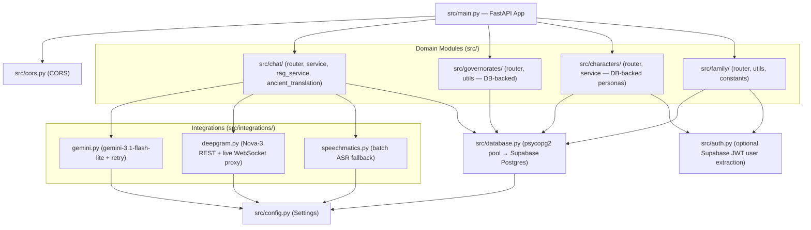

# Hakawi Backend Documentation

## Overview

The Hakawi backend is a modular FastAPI application built with a **Feature-Based (Modular Domain)** architecture. It powers dialectal voice chat, live speech-to-text (STT), text-to-speech (TTS) voice cloning, historical Ancient Mode (RAG), family heritage tree preservation, and **Supabase-backed persistence and authentication**.

Data lives in **Supabase** (PostgreSQL + Auth + Storage):
- The backend connects to Postgres **directly** via `DATABASE_URL` (bypasses RLS — the backend is the data gatekeeper).
- The frontend uses the **anon key** only for Supabase Auth (signup/login) and reads public Storage assets.
- Character/voice assets are served from the public `characters` and `avatars` Storage buckets.

---

## 🏗️ Architecture Diagram



---

## 📁 File Structure & Roles

```
backend/
├── .env                          # Environment secrets (see below)
├── Dockerfile                    # Container config (uvicorn src.main:app, port 7860)
├── Procfile                      # PaaS process file
├── requirements/
│   ├── base.txt                  # Core app dependencies
│   ├── dev.txt                   # Testing & linting packages
│   └── prod.txt                  # Production ASGI servers
│
├── data/
│   └── rag/                      # RAG knowledge base
│       ├── monuments_data.txt    # Source dossiers (source of truth)
│       ├── chunks.json           # Parsed chunks (tools/prepare_data2.py)
│       └── embeddings.json       # Gemini embeddings (tools/index_data.py)
│
└── src/
    ├── main.py                   # FastAPI app init, OTel/Phoenix tracing, router mounting, /health
    ├── config.py                 # Pydantic Settings loading .env
    ├── database.py               # psycopg2 ThreadedConnectionPool + cursor helpers
    ├── auth.py                   # Optional user ID extraction from Supabase Bearer JWT
    ├── cors.py                   # CORS middleware setup
    │
    ├── chat/                     # 💬 Conversation & Heritage AI Engine
    │   ├── router.py             # /api/chat/*, /api/stt, /api/ws/stt endpoints
    │   ├── schemas.py            # Chat request/response DTOs (text, audio, ancient, history)
    │   ├── service.py            # Chat persistence (chat_sessions + chat_messages) & text cleanup
    │   ├── rag_service.py        # In-memory numpy cosine search over embeddings.json + prompt building
    │   ├── ancient_translation.py# Dual Arabic + ancient-Egyptian transliteration output
    │   ├── utils.py              # Persona lookup (historical_prompts table) & instruction formatting
    │   ├── constants.py          # Arabic persona/diacritics prompt rules
    │   ├── prompts.py            # Backwards-compat re-exports
    │   └── metrics.py            # PipelineMetrics observability (Phoenix/OTel spans)
    │
    ├── characters/               # 🎙️ Voice & Voice-Cloning Domain
    │   ├── router.py             # /api/tts, /api/characters/add, /api/characters, /api/registry
    │   ├── service.py            # Lightning TTS client, lazy zero-shot cloning, Storage audio fetch
    │   ├── utils.py              # voice_personas DB lookups (get_voice, resolve_character_ref)
    │   ├── schemas.py            # TTSRequest schema
    │   ├── personas.py           # Backwards-compat re-exports (personas live in DB now)
    │   └── constants.py          # DEFAULT_VOICE, audio dir
    │
    ├── family/                   # 👨‍👩‍👧‍👦 Family Tree & Memory Preservation Domain
    │   ├── router.py             # GET/POST /api/family-tree (family_trees + family_members sync)
    │   ├── utils.py              # Family prompt builder & recursive tree traversal
    │   ├── constants.py          # FAMILY_PROMPTS relation templates & DEFAULT_TREE_ID
    │   └── service.py            # Re-exports
    │
    ├── governorates/             # 🏛️ Governorates & Monuments Domain
    │   ├── router.py             # GET /api/governorates
    │   ├── utils.py              # DB queries + row→API mapping
    │   ├── registry.py           # Backwards-compat re-exports (registry lives in DB now)
    │   └── constants.py          # DEFAULT_VOICE_KEY
    │
    ├── integrations/             # 🔌 External API Clients
    │   ├── gemini.py             # Gemini client with retry + rate-limit handling + OTel spans
    │   ├── deepgram.py           # Deepgram Nova-3 REST transcription + live WS proxy
    │   └── speechmatics.py       # Speechmatics batch STT (fallback)
    │
    ├── seed_supabase.py          # One-off: seed all tables from seed_fixtures.py
    ├── seed_fixtures.py          # Hardcoded seed data (monuments, personas, voices, default tree)
    ├── setup_auth_sync.py        # One-off: profiles RLS, auth triggers, avatars bucket
    └── migrate_db_assets.py      # One-off: asset URL columns, characters bucket, asset uploads
```

---

## 🗄️ Database (Supabase PostgreSQL)

The backend talks to Postgres via a pooled direct connection (`DATABASE_URL`). Key tables:

| Table | Purpose |
|---|---|
| `governorates` | Governorate keys, Arabic/English names, map coordinates |
| `monuments` | Monuments per governorate: display names, builders, bios, GPS, chips (quick replies), voice keys, asset URLs |
| `historical_prompts` | Persona definitions per monument (tone, language, vocabulary, example, avoid) |
| `voice_personas` | Voice registry: ref audio path (Supabase Storage URL), ref text, `is_custom`/`is_cloned` flags, user ownership |
| `chat_sessions` | One row per session: mode (regional/family_member/ancient), governorate/monument/member refs, title, timestamps |
| `chat_messages` | Two rows per turn (`role='user'` + `role='assistant'`), linked by `session_id`; assistant rows carry a `metadata` JSON (builder, persona, tts_text) |
| `family_trees` | Full tree JSON (`tree_data`) per user |
| `family_members` | Flattened member rows synced from tree saves |
| `family_relationships` / `family_occasions` | Kinship edges and member occasions |
| `profiles` | User profiles, kept in sync with `auth.users` via triggers |

---

## 🎙️ Voice System (Text-to-Speech)

Zero-shot voice cloning via an external Lightning TTS server. Voice personas live in the `voice_personas` table (no longer hardcoded).

### How it works
1. Each monument row defines `modern_voice_key` / `ancient_voice_key` (e.g. `"am-othman"`, `"ramsis"`).
2. The frontend sends the `character_name` to `/api/tts` along with the text.
3. `src/characters/service.py` checks if the voice is already cloned (in-memory cache + `voice_personas.is_cloned`).
4. If not, it **lazily clones on first generation**: fetches the reference audio from Supabase Storage, sends it with `ref_text` to the TTS server (`action: "save_character"`), and marks `is_cloned = true` in the DB.
5. It then requests speech generation (`action: "generate"`) and returns the decoded `.wav`.

### How to add a new voice
1. **Register in DB**: insert into `voice_personas` (or use `POST /api/characters/add`, which also uploads audio to the `characters` Storage bucket):
   ```sql
   INSERT INTO public.voice_personas (key, name, ref_audio_path, ref_text, is_custom, is_cloned)
   VALUES ('new_voice', 'اسم الشخصية', '<audio URL or local path>', 'النص المكتوب الذي يقال في المقطع الصوتي بالضبط', false, false);
   ```
2. **Assign**: set `modern_voice_key` / `ancient_voice_key` on the desired monument rows.
3. **UI Assets**: ensure the frontend (or the `characters` Storage bucket) has the idle/talking videos and avatar.

---

## 🔗 API Endpoints

| Endpoint | Method | Domain | Description |
|---|---|---|---|
| `/health` | `GET` | System | Health check and RAG readiness status. |
| `/api/governorates` | `GET` | Governorates | All governorates with nested monuments, GPS, voices, chips & asset URLs. |
| `/api/chat/text` | `POST` | Chat | Text chat with a regional or family persona. |
| `/api/chat/audio` | `POST` | Chat | Audio chat: transcribes (Deepgram → Speechmatics fallback), queries persona, returns response. |
| `/api/chat/ancient` | `POST` | Chat | RAG-backed historical chat with monument-constrained retrieval, response modes (`direct`/`hikaya`/`presentation`) and language modes (`modern`/`ancient`). |
| `/api/chat/history` | `GET` | Chat | Messages by `session_id`, or most recent session by monument/member/mode. |
| `/api/stt` | `POST` | Chat | Transcription only (no AI response). |
| `/api/ws/stt` | `WS` | Chat | Live streaming STT — WebSocket proxy to Deepgram Nova-3 (key stays server-side). |
| `/api/tts` | `POST` | Characters | Text-to-speech with voice cloning. Returns `.wav` audio. |
| `/api/characters/add` | `POST` | Characters | Registers a custom voice: saves audio to disk + Supabase Storage, upserts `voice_personas` (cloning deferred to first use). |
| `/api/characters` | `GET` | Characters | Lists all voice keys from `voice_personas`. |
| `/api/registry` | `GET` | Characters | Full `voice_personas` registry (audio refs, video/avatar URLs). |
| `/api/family-tree` | `GET` | Family | Retrieves the family tree JSON. |
| `/api/family-tree` | `POST` | Family | Saves the tree and syncs members into `family_members`. |

---

## 🔄 Request Flow (Ancient Mode)

```
POST /api/chat/ancient
  → validate monument_key against monuments table
  → embed question (gemini-embedding-001)
  → cosine search over embeddings.json (constrained to the monument)
  → pick persona from historical_prompts
  → build anti-hallucination prompt (mode-aware: direct / hikaya / presentation)
  → Gemini generation (low temperature)
  → ancient mode: dual Arabic + old-Egyptian output for TTS
  → persist turn (chat_sessions upsert + 2 chat_messages rows)
  → return response, tts_text, character_name
```

---

## 🚀 How to Run Locally

### Requirements
- Python 3.10+
- Install dependencies:
  ```bash
  pip install -r requirements/base.txt
  ```
- `.env` file in `backend/`:
  ```env
  GEMINI_API_KEY=your_key
  DEEPGRAM_API_KEY=your_key            # primary STT
  SPEECHMATICS_API_KEY=your_key        # STT fallback (optional)
  VOICE_API_URL=your_tts_server_url
  DATABASE_URL=postgresql://...        # Supabase Postgres connection string
  SUPABASE_URL=https://<project>.supabase.co
  SUPABASE_ANON_KEY=your_anon_key      # used for Storage uploads
  ```

### One-off setup scripts (run from `backend/`)
```bash
python -m src.seed_supabase       # seed governorates, monuments, personas, voices, default family tree
python -m src.setup_auth_sync     # profiles RLS + auth triggers + avatars bucket
python -m src.migrate_db_assets   # asset URL columns + characters bucket + asset uploads
```

### Start the Server
```bash
uvicorn src.main:app --reload --host 0.0.0.0 --port 8000
```

- API Docs: `http://localhost:8000/docs`
- Health Check: `http://localhost:8000/health`

### Rebuilding the RAG Index
If you update `data/rag/monuments_data.txt`, rebuild the index:
```bash
cd tools
python prepare_data2.py
python index_data.py   # requires GEMINI_API_KEY env var
```
This updates `data/rag/embeddings.json`. Restart the backend to reload the new index into memory.

---

## 📊 Observability (optional)

If `opentelemetry` / Phoenix packages are installed, the backend automatically:
- Instruments incoming FastAPI requests and outgoing HTTP calls
- Sends RAG search, Gemini generation, and pipeline latency metrics to a local Phoenix instance (`http://localhost:6006`)
- Falls back to console logging when not installed
