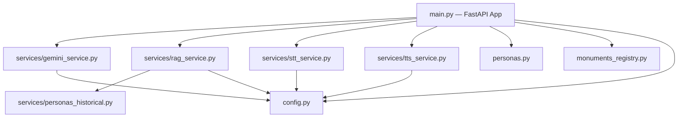

# Hakawi Backend Documentation

## Overview

The Hakawi backend is a FastAPI application that powers the chat, text-to-speech (TTS), and speech-to-text (STT) features for the Hakawi interactive map.

It uses a modular service architecture and leverages two modes of interaction:
1. **Regional Dialect Chat**: General conversation using regional personas (e.g., "am-othman").
2. **Ancient Mode (RAG)**: Fact-grounded historical conversation using a pre-computed vector index of monument data.

---

## Architecture Diagram



---

## File Structure & Roles

### Core Application
- **`main.py`**: The FastAPI entry point. Defines all HTTP endpoints, manages chat session history in memory, and wires together the services.
- **`config.py`**: Pydantic Settings model. Loads environment variables (API keys and URLs) from `.env`.
- **`monuments_registry.py`**: The single source of truth for all locations. Maps governorates to their monuments, defines map coordinates, and links each monument to its `character_name` (voice ID) and RAG filter keys.
- **`personas.py`**: The voice registry. Contains the `VOICES` dictionary mapping `character_name` to its reference audio and display name.

### Services
- **`services/gemini_service.py`**: The unified client for Google's Gemini API. Exposes the `generate()` function which handles retries, rate limits, and model configuration (temperature, tokens).
- **`services/rag_service.py`**: Handles the "Ancient Mode" logic. Loads `embeddings.json` into memory, performs cosine similarity search, and constructs the augmented prompt using `personas_historical.py`.
- **`services/personas_historical.py`**: Contains the strict system prompts, behavioral rules, and vocabulary instructions for all 19 historical characters used in Ancient Mode.
- **`services/stt_service.py`**: Integrates with the Speechmatics Batch API for high-quality Arabic audio transcription.
- **`services/tts_service.py`**: Integrates with the custom Lightning TTS server for zero-shot voice cloning.

### Data & Tools
- **`data/rag/`**: Contains the knowledge base. `monuments_data.txt` (source text), `chunks.json` (parsed chunks), and `embeddings.json` (vector index).
- **`data/characters/`**: Contains the `.mp3` reference audio files used for voice cloning, plus `registry.json` for fallback lookups.
- **`tools/prepare_data.py`**: Script to parse `monuments_data.txt` into `chunks.json`.
- **`tools/index_data.py`**: Script to generate embeddings via Gemini and output `embeddings.json`.

---

## Voice System (Text-to-Speech)

The backend uses zero-shot voice cloning via an external Lightning TTS server.

### How it works
1. Every monument in `monuments_registry.py` defines a `character_name` (e.g., `"am-othman"`).
2. The frontend sends this `character_name` to the `/api/tts` endpoint along with the text.
3. `tts_service.py` looks up the `character_name` in `personas.py` (`VOICES` dict).
4. If it's a new character, it sends the `ref_audio_path` and `ref_text` to the TTS server to "register" the voice.
5. It then requests speech generation using that registered voice name.

### How to add a new voice
1. **Record Audio**: Place a short, clear Arabic audio clip (e.g., ~10 seconds) in `backend/data/characters/new_voice.mp3`.
2. **Register**: Add the voice to `personas.py`:
   ```python
   VOICES = {
       "new_voice": {
           "name": "اسم الشخصية",
           "ref_audio_path": "data/characters/new_voice.mp3",
           "ref_text": "النص المكتوب الذي يقال في المقطع الصوتي بالضبط",
       }
   }
   ```
3. **Assign**: Update `monuments_registry.py` to use `"character_name": "new_voice"` for the desired monuments.
4. **UI Assets**: Ensure the frontend has `/public/character/new_voice-idle.mp4` and `-talking.mp4`.

---

## API Endpoints

| Endpoint | Method | Description |
|----------|--------|-------------|
| `/health` | `GET` | Returns API status and RAG readiness. |
| `/api/chat/ancient` | `POST` | RAG-backed chat. Takes `{text, monument_key}`. |
| `/api/chat/text` | `POST` | General dialect chat. Takes `{text, region, session_id}`. |
| `/api/chat/audio` | `POST` | Like text chat, but accepts an audio file (STT) and returns audio (TTS). |
| `/api/stt` | `POST` | Standalone audio transcription using Speechmatics. |
| `/api/tts` | `POST` | Standalone voice generation. Takes `{text, character_name}`. |
| `/api/map/registry` | `GET` | Returns the full governorates and monuments list. |
| `/api/characters/add` | `POST` | Runtime endpoint to register new voices dynamically. |

---

## How to Run Locally

### Requirements
- Python 3.10+
- `pip install -r requirements.txt`
- `.env` file containing:
  ```env
  GEMINI_API_KEY=your_key
  SPEECHMATICS_API_KEY=your_key
  VOICE_API_URL=your_tts_server_url
  ```

### Start the Server
```bash
uvicorn main:app --reload --host 0.0.0.0 --port 5000
```

### Rebuilding the RAG Index
If you update `data/rag/monuments_data.txt`, you must rebuild the index:
```bash
cd tools
python prepare_data.py
python index_data.py
```
This will overwrite `data/rag/embeddings.json`. Restart the backend to load the new index.
