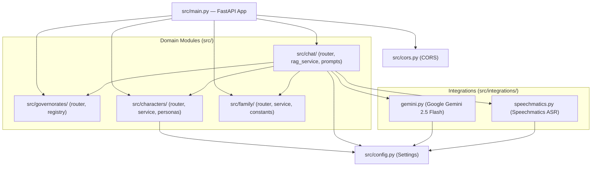

# Hakawi Backend Documentation

## Overview

The Hakawi backend is a modular FastAPI application built with a **Feature-Based (Modular Domain)** architecture. It powers dialectal voice chat, text-to-speech (TTS) voice cloning, speech-to-text (STT), historical Ancient Mode (RAG), and interactive family heritage tree features.

---

## 🏗️ Architecture Diagram



---

## 📁 File Structure & Roles

```
backend/
├── .env                          # Environment secrets (GEMINI_API_KEY, etc.)
├── Dockerfile                    # Container configuration (CMD uvicorn src.main:app)
├── Procfile                      # PaaS process file (uvicorn src.main:app)
├── requirements/                 # Modular dependencies
│   ├── base.txt                  # Core app dependencies
│   ├── dev.txt                   # Testing & linting packages
│   └── prod.txt                  # Production ASGI servers
│
├── data/                         # Persistent media & dataset storage
│   ├── characters/               # Audio reference files (.wav.mp3) & character registries
│   └── rag/                      # RAG knowledge base (chunks.json & embeddings.json)
│
└── src/                          # Application Source Code
    ├── main.py                   # FastAPI application initialization & router mounting
    ├── config.py                 # Pydantic Settings model loading .env
    ├── cors.py                   # CORS middleware setup
    │
    ├── governorates/             # 🏛️ Governorates & Monuments Domain
    │   ├── registry.py           # Single source of truth for map data & GPS coordinates
    │   └── router.py             # GET /api/governorates endpoint
    │
    ├── characters/               # 🎙️ Voice & Voice-Cloning Domain
    │   ├── personas.py           # VOICES dictionary mapping characters to reference audio
    │   ├── schemas.py            # TTSRequest schema
    │   ├── service.py            # Lightning TTS API client & zero-shot cloning logic
    │   └── router.py             # /api/tts, /api/characters/add, /api/characters, /api/registry
    │
    ├── chat/                     # 💬 Conversation & Heritage AI Engine
    │   ├── schemas.py            # Chat request/response DTOs (Text, Audio, Ancient)
    │   ├── service.py            # In-memory LRU session store & text cleanup
    │   ├── prompts.py            # Strict historical prompts and dialect guidelines
    │   ├── rag_service.py        # Vector cosine similarity search over embeddings.json
    │   ├── ancient_translation.py# Ancient Egyptian transliteration helper
    │   └── router.py             # /api/chat/text, /api/chat/audio, /api/chat/ancient, /api/stt
    │
    ├── family/                   # 👨‍👩‍👧‍👦 Family Tree & Memory Preservation Domain
    │   ├── constants.py          # FAMILY_PROMPTS relation templates & DEFAULT_TREE_DATA
    │   ├── service.py            # Relationship prompt builder & tree traversal logic
    │   └── router.py             # GET /api/family-tree, POST /api/family-tree
    │
    └── integrations/             # 🔌 External API Clients
        ├── gemini.py             # Google Gemini 2.5 Flash client with retry logic
        └── speechmatics.py       # Speechmatics STT audio transcription client
```

---

## 🎙️ Voice System (Text-to-Speech)

The backend uses zero-shot voice cloning via an external Lightning TTS server.

### How it works
1. Every monument in `src/governorates/registry.py` defines a `character_name` (e.g. `"am-othman"`).
2. The frontend sends this `character_name` to the `/api/tts` endpoint along with the text.
3. `src/characters/service.py` looks up the character in `src/characters/personas.py` (`VOICES` dict).
4. If it's a new character, it sends the reference audio clip and `ref_text` to the TTS server to register the voice.
5. It then requests speech generation using that registered voice identifier.

### How to add a new voice
1. **Record Audio**: Place a short, clear Arabic audio clip in `backend/data/characters/new_voice.mp3`.
2. **Register**: Add the voice to `src/characters/personas.py`:
   ```python
   VOICES = {
       "new_voice": {
           "name": "اسم الشخصية",
           "ref_audio_path": "data/characters/new_voice.mp3",
           "ref_text": "النص المكتوب الذي يقال في المقطع الصوتي بالضبط",
       }
   }
   ```
3. **Assign**: Update `src/governorates/registry.py` to use `"character_name": "new_voice"` for the desired monuments.
4. **UI Assets**: Ensure the frontend has `/public/character/new_voice-idle.mp4` and `-talking.mp4`.

---

## 🔗 API Endpoints

| Endpoint | Method | Domain | Description |
|---|---|---|---|
| `/health` | `GET` | System | Health check and RAG readiness status. |
| `/api/governorates` | `GET` | Governorates | Returns all governorates with monuments, GPS coordinates & prompts. |
| `/api/chat/text` | `POST` | Chat | Text chat with a regional or family persona. |
| `/api/chat/audio` | `POST` | Chat | Audio chat: transcribes audio, queries persona, returns AI response. |
| `/api/chat/ancient` | `POST` | Chat | Ancient Mode: RAG-backed factual historical chat with Pharaonic personas. |
| `/api/stt` | `POST` | Chat | Transcribes audio to Arabic text without generating an AI response. |
| `/api/tts` | `POST` | Characters | Converts text to speech using voice cloning. Returns `.wav` audio. |
| `/api/characters/add` | `POST` | Characters | Registers a new custom voice (audio sample + reference text). |
| `/api/characters` | `GET` | Characters | Lists all registered in-memory voice names. |
| `/api/registry` | `GET` | Characters | Returns disk `registry.json` of custom saved characters. |
| `/api/family-tree` | `GET` | Family | Retrieves the interactive family tree data structure. |
| `/api/family-tree` | `POST` | Family | Saves the modified family tree hierarchy. |

---

## 🚀 How to Run Locally

### Requirements
- Python 3.10+
- Install dependencies:
  ```bash
  pip install -r requirements/base.txt
  ```
- `.env` file in `backend/`:
  ```env
  GEMINI_API_KEY=your_key
  SPEECHMATICS_API_KEY=your_key
  VOICE_API_URL=your_tts_server_url
  ```

### Start the Server
```bash
uvicorn src.main:app --reload --host 0.0.0.0 --port 8000
```

- API Docs: `http://localhost:8000/docs`
- Health Check: `http://localhost:8000/health`

### Rebuilding the RAG Index
If you update `data/rag/monuments_data.txt`, rebuild the index:
```bash
cd tools
python prepare_data2.py
python index_data.py
```
This updates `data/rag/embeddings.json`. Restart the backend to reload the new index into memory.
