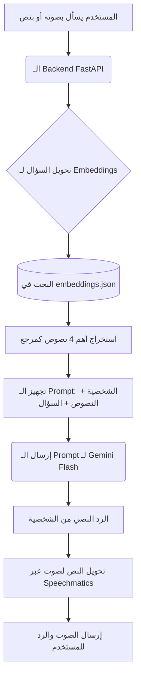

# فهم الـ RAG في مشروع حكاوي

بناءً على طلبك، قمت بمراجعة ملفات الـ RAG (Retrieval-Augmented Generation) الموجودة في المشروع (`prepare_data2.py`، `index_data.py`، `ask_hikawi.py`، و `server_fixed.py`). في هذا الملف، سأشرح لك ما هو الـ RAG، كيف يعمل بشكل عام، كيف تم تطبيقه في مشروعك، وكيف يمكننا دمجه في الـ Backend الأساسي (FastAPI).

---

## 1. ما هو الـ RAG؟ وكيف يعمل؟

الـ **RAG (Retrieval-Augmented Generation)** أو "التوليد المعزز بالاسترجاع" هو تقنية تُستخدم لجعل نماذج الذكاء الاصطناعي (مثل Gemini أو ChatGPT) تجيب على أسئلة بناءً على قاعدة بيانات أو نصوص مخصصة تملكها أنت، بدلاً من الاعتماد فقط على المعلومات العامة التي تدرب عليها النموذج، مما يمنع "الهلوسة" (Hallucination) ويضمن دقة المعلومات.

### كيف يعمل الـ RAG في 3 خطوات بسيطة:

1. **التقطيع والتحويل (Indexing / Embedding):**
   - نقوم بأخذ الملفات النصية الكبيرة ونقسمها إلى أجزاء صغيرة (Chunks).
   - نقوم بتحويل كل جزء نصي إلى مصفوفة من الأرقام تسمى **"متجهات" (Embeddings)** باستخدام نموذج ذكاء اصطناعي. هذه الأرقام تمثل "المعنى" للكلمات.
   - نحفظ هذه المتجهات في قاعدة بيانات (Vector Database أو ملف JSON).

2. **البحث والاسترجاع (Retrieval):**
   - عندما يسأل المستخدم سؤالاً، نقوم بتحويل سؤاله أيضاً إلى "متجه" (Embedding) باستخدام نفس النموذج.
   - نقارن متجه السؤال بمتجهات النصوص المحفوظة (باستخدام عملية حسابية كـ Cosine Similarity) لنجد أقرب النصوص التي تحمل إجابة السؤال.

3. **التوليد والإجابة (Generation):**
   - نأخذ السؤال + النصوص التي وجدناها (Context)، ونرسلها لنموذج توليد نصوص (مثل Gemini Flash).
   - نطلب من النموذج: "بناءً على هذه النصوص فقط، أجب على هذا السؤال".

---

## 2. كيف تم تطبيق الـ RAG في مشروع حكاوي؟

الـ RAG الخاص بك مقسم إلى 3 ملفات رئيسية تشرح دورة حياة البيانات:

### أ. تجهيز البيانات (`prepare_data2.py`):
- يقرأ ملف `monuments_data.txt` الذي يحتوي على معلومات الآثار.
- يقوم بتقسيم النص إلى قطع صغيرة (Chunks) بناءً على العناوين (Headers) والأرقام.
- يضيف لكل قطعة اسم الأثر (Monument) واسم الشخصية (Builder).
- يحفظ النتيجة في ملف `chunks.json`.

### ب. إنشاء المتجهات (`index_data.py`):
- يقرأ الـ `chunks.json`.
- يستخدم موديل `gemini-embedding-001` لتحويل كل قطعة نصية إلى متجهات أرقام (Embeddings).
- يحفظ النصوص مع متجهاتها في ملف `embeddings.json`.

### ج. خادم المحادثة (`server_fixed.py` / `ask_hikawi.py`):
عندما يسأل المستخدم سؤالاً، يحدث الآتي:
1. يتم تحويل السؤال إلى Embeddings عبر `gemini-embedding-001`.
2. الدالة `cosine_similarity` تبحث في `embeddings.json` عن أقرب 4 قطع نصية للسؤال.
3. الدالة `get_persona` تحدد شخصية الأثر (مثلًا: خوفو، حتشبسوت) وتجلب تعليمات نبرة الصوت والمفردات من قاموس `PERSONAS`.
4. الدالة `ask_character` تبني الـ Prompt الذي يحتوي على (تعليمات الشخصية + القطع النصية المسترجعة + سؤال الزائر)، وترسله إلى موديل `gemini-2.5-flash` ليقوم بالرد باللغة العربية كشخصية تاريخية، وبجمل قصيرة (فقرتين).

---

## 3. كيف يجب أن ندمج هذا في الـ Backend الأساسي (FastAPI)؟

حالياً، الـ Backend الأساسي موجود في مجلد `backend/` ويستخدم إطار عمل **FastAPI**. بينما ملفات الـ RAG تعمل كسكربتات منفصلة أو خادم Flask بسيط (`server_fixed.py`). لدمجهم بشكل احترافي، سنتبع هذه الخطة:

### الخطوة الأولى: نقل البيانات
- سننقل ملفات البيانات (`embeddings.json`، `chunks.json`، `monuments_data.txt`) إلى مجلد `backend/data/`.

### الخطوة الثانية: تحديث خدمة الـ AI (`gemini_service.py`)
سنجعل الـ RAG جزءاً أساسياً من تدفق الردود في ملف `gemini_service.py` في הـ Backend:

1. **تحميل البيانات عند بدء السيرفر:** قراءة `embeddings.json` مرة واحدة في الذاكرة لتسريع البحث.
2. **دمج القاموس:** دمج قاموس `PERSONAS` الموجود في `server_fixed.py` مع ملف `personas.py` الموجود حالياً في الـ Backend.
3. **البحث (Retrieval):** إضافة دالة `search` لتحويل سؤال المستخدم لـ Embedding وجلب أقرب 4 نتائج.
4. **التوليد (Generation):** تعديل دالة `generate_response` بحيث تستقبل النصوص المسترجعة (Context)، وتدمجها مع تعليمات الشخصية (`system_prompt`) والسؤال لتوليد الرد النهائي عبر Gemini.

### شكل التدفق الجديد في الـ Backend:

> [!TIP]
> **ميزة هذا الدمج:** سيبقى السيرفر سريعاً لأنه يستخدم البحث المحلي المباشر (Cosine Similarity في الذاكرة) بدلاً من قاعدة بيانات ضخمة، وسيضمن أن الذكاء الاصطناعي لا يهلوس بمعلومات تاريخية خاطئة، بل يجيب بثقة من نصوص `monuments_data.txt` التي وفرتها له.

إذا كنت مستعداً، يمكنني البدء فوراً في تنفيذ هذه التعديلات ودمج كود الـ RAG داخل `backend/services/gemini_service.py`!
